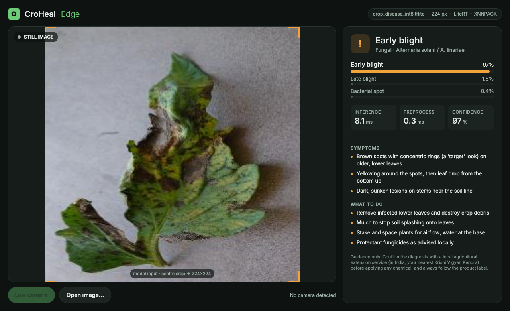
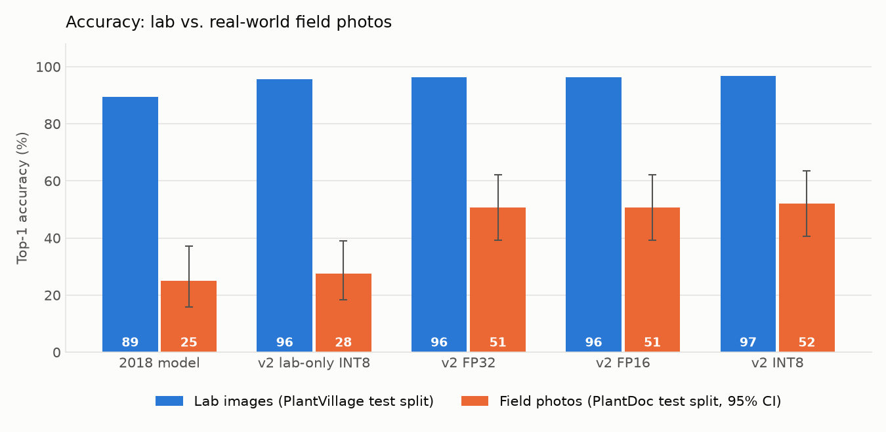
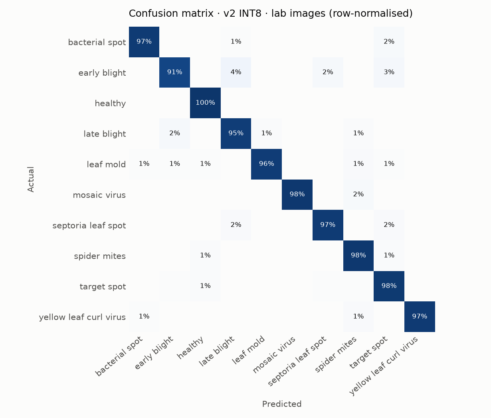
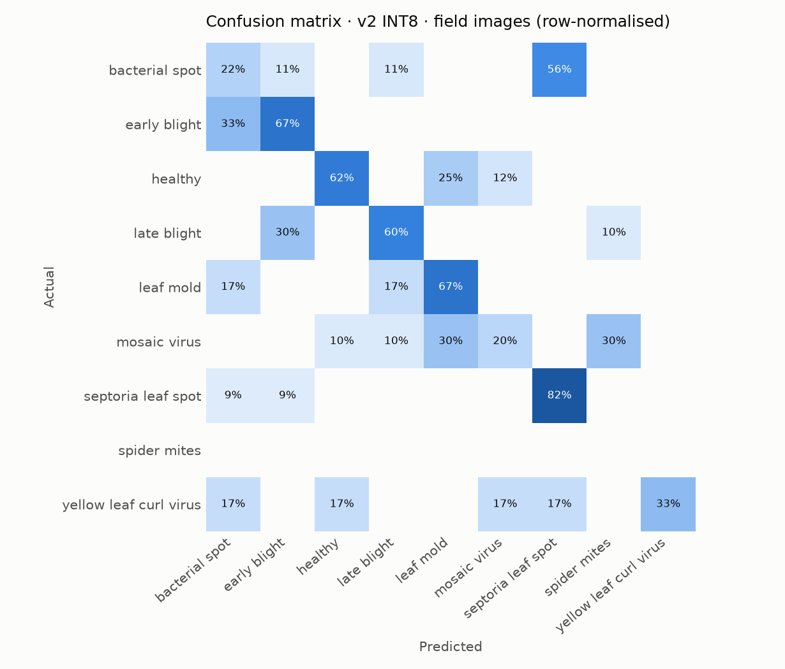
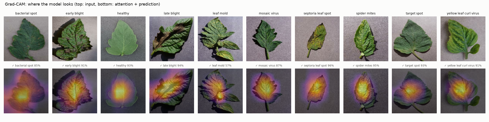
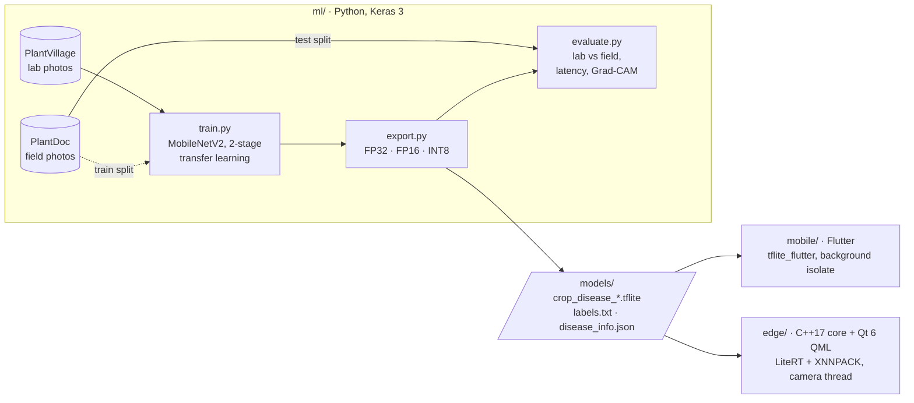

# CroHeal: on-device tomato leaf disease identification

[](../../actions/workflows/ml.yml)
[](../../actions/workflows/mobile.yml)
[](../../actions/workflows/edge.yml)

**Train once, deploy to phone and edge.** A single LiteRT (TensorFlow Lite) model
identifies 9 tomato diseases and pests, plus healthy leaves, entirely offline. It
runs in a **Flutter** app on Android/iOS and in a **C++17 / Qt 6 QML** app on Linux
edge devices (Raspberry Pi, Jetson) with a live camera.

<p align="center"></p>

> Originally built in 2018 as an M.Tech project (Flutter + a 9-class TFLite model).
> v2 (2026) rebuilds the training pipeline, both apps and the evaluation from scratch.
> The 2018 code is kept in [`legacy/`](legacy/).

## Results

Evaluated on two held-out sets that the models never saw during training:

- **Lab:** the PlantVillage test split (2,725 photos of single leaves on a plain background).
- **Field:** PlantDoc's official test split (69 real-world photos from 8 classes, with
  cluttered backgrounds and natural light). It's small, so 95% confidence intervals are shown.

| Model | Size | Lab accuracy | Lab macro-F1 | Field accuracy (95% CI) | Field: answers / right when it answers |
|---|---|---|---|---|---|
| 2018 model (9 classes)¹ | 2.1 MB | 89.4% | 0.859 | **25.0%** (16%–37%) | 97% / 26% |
| v2, PlantVillage only | 2.7 MB | 95.5% | 0.943 | **27.5%** (18%–39%) | 48% / 39% |
| v2 FP32 | 8.9 MB | 96.4% | 0.960 | **50.7%** (39%–62%) | 55% / 74% |
| v2 FP16 | 4.5 MB | 96.4% | 0.960 | **50.7%** (39%–62%) | 55% / 74% |
| **v2 INT8 (shipped)** | 2.7 MB | 96.8% | 0.964 | **52.2%** (41%–64%) | 59% / 73% |

<p align="center"></p>

What the numbers show:

- **Lab accuracy 89% → 97%**, now with all 10 classes, from MobileNetV2 with a global-average-pooling
  head, label smoothing, class weights and two-stage fine-tuning.
- **Field accuracy 25% → 52%.** Training on lab photos alone barely helps in the field (28%).
  Mixing in PlantDoc's *train* split (×4 oversampled, with near-duplicates of test photos
  removed by perceptual hash) is what doubles it.
- **The app knows when it's unsure.** The last column applies the apps' "Not sure" rule
  (top-1 < 55% or a runner-up within 15 points). The 2018 model answered on 97% of field photos and was
  right only 26% of the time. v2 answers on 59% and is right 73% of the time; the rest get "Not sure,
  retake the photo".
- **INT8 is free.** It's 3× smaller than FP32 with no accuracy loss, so it's the variant both apps ship.
- **Latency** (`cropdx-cli --bench`, Xeon 2.1 GHz, 2 threads, XNNPACK): INT8 **2.7 ms**, FP32 4.3 ms
  per image. The C++ output matches Python LiteRT to within 0.008 probability (checked in CI).

¹ The 2018 model has no bacterial-spot class, so its lab score covers 9 classes. It was also trained on
PlantVillage with an unknown split, so its lab score is likely optimistic.

<details>
<summary>Confusion matrices and Grad-CAM</summary>

 

Most field errors are look-alike spot diseases (bacterial spot vs. septoria, early vs. late blight)
and mosaic virus vs. leaf mould.


</details>

## Architecture



**One input contract everywhere.** Every model variant takes `float32 [1,224,224,3]`
RGB in **0–255**: centre-crop to a square, then an anti-aliased resize. Normalisation
is baked into the graph, so the backbone can change without touching either app. The
contract is implemented three times (Python, Dart, C++) and checked by tests,
including a C++ ↔ Python parity test on the exported model.

| | 2018 (M.Tech) | 2026 (v2) |
|---|---|---|
| Classes | 9 (no bacterial spot) | 10 |
| Training | Keras notebooks, `tensorflow.compat.v1`, Flatten head | Keras 3 package, `tf.data`, GAP head, label smoothing, class weights, 2-stage fine-tuning, fixed committed splits |
| Evaluation | accuracy on a random split | lab test split **and** real-world field photos, macro-F1, confusion matrices, latency, Grad-CAM |
| Model export | single float model | FP32 / FP16 / INT8 with checksums and `model_info.json` |
| Mobile | Flutter (Dart 2), `tflite` 1.1.2 (discontinued), UI-thread inference | Flutter 3 / Dart 3, `tflite_flutter`, inference in a background isolate, Riverpod, Material 3, confidence gating, disease guide, scan history |
| Edge | n/a | C++17 core library + CLI benchmark + Qt 6 QML live-camera app |
| Quality | none | unit/widget tests, C++ parity tests, GitHub Actions for all three parts |

## Repository layout

```
ml/        training, export, evaluation, Grad-CAM, Colab notebook   → ml/README.md
models/    the shipped artefacts (tflite variants, labels, disease guide, model_info.json)
mobile/    Flutter app                                               → mobile/README.md
edge/      C++17 core + CLI + Qt 6 / QML app                          → edge/README.md
legacy/    the original 2018 notebooks and model
docs/      images used in this README
```

## Quick start

**Train and evaluate** (CPU works; GPU or [Colab](ml/notebooks/train_colab.ipynb) is faster):

```bash
cd ml
pip install -r requirements.txt
scripts/fetch_data.sh                      # tomato subsets of PlantVillage + PlantDoc
python -m cropdx.train --set output_dir=runs/lab                     # stage 1+2 on lab photos
python -m cropdx.train --set init_from=runs/lab/best.keras head_epochs=0 finetune_epochs=6 \
  finetune_unfreeze_fraction=0.5 field_train_root=data/plantdoc output_dir=runs/field   # + field photos
python -m cropdx.export --model runs/field/best.keras --out ../models
python -m cropdx.evaluate --models ../models --legacy ../legacy/2018-model/model_unquant.tflite
```

**Mobile:**

```bash
cd mobile
tool/bootstrap.sh          # generates android/ + ios/, syncs the model (Windows: tool\bootstrap.ps1)
flutter run
```

**Edge:**

```bash
cmake -S edge -B edge/build -G Ninja -DCMAKE_BUILD_TYPE=Release && cmake --build edge/build
edge/build/app/cropdx-app                                  # live camera or open an image
edge/build/cli/cropdx-cli --model models/crop_disease_int8.tflite --labels models/labels.txt --bench 200 leaf.jpg
```

## Limitations and next steps

- **Field accuracy (52%) is the main open problem.** PlantVillage dominates training, and
  PlantDoc offers only ~670 field photos. Next steps: collect more field photos (ideally
  from the target region), segment-and-paste background augmentation, a larger backbone
  (EfficientNet-B0 / MobileNetV3 are already supported), and test-time augmentation.
- **Out-of-distribution input.** A softmax classifier always answers. Both apps show
  "Not sure" below 55% confidence or when the top two classes are within 15 points,
  but a dedicated "not a tomato leaf" class or an OOD detector would be better.
- PlantVillage contains near-duplicate photos of the same leaf, so a random split
  slightly overstates lab accuracy.
- The disease guidance is general. Confirm with a local agricultural extension
  service (in India, a Krishi Vigyan Kendra) before treating a crop.

## Data and credits

- [PlantVillage dataset](https://github.com/spMohanty/PlantVillage-Dataset) (Hughes &
  Salathé, 2015), tomato classes, used for training.
- [PlantDoc dataset](https://github.com/pratikkayal/PlantDoc-Dataset) (Singh et al.,
  2020), tomato classes, used **only** for field evaluation.
- See each dataset's repository for its licence terms. Code is MIT-licensed ([LICENSE](LICENSE)).
